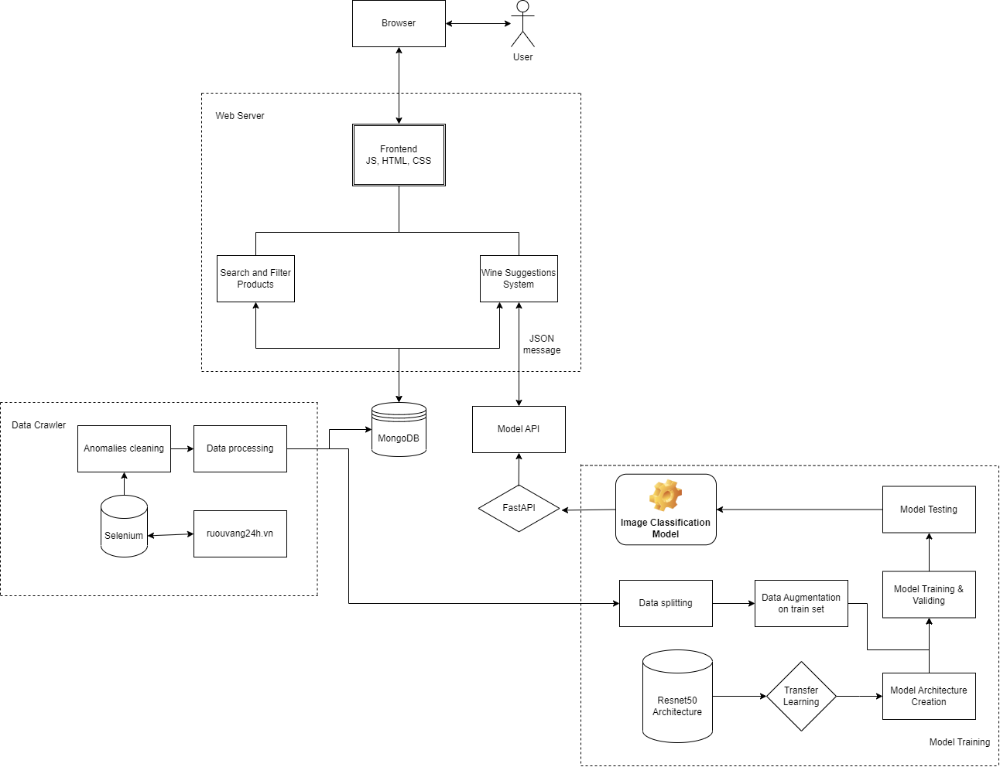

# Project Overview

## Live Demo: https://wine-cart.vercel.app/

## Executive Summary
Wine-Cart is a high-performance, full-stack recommendation platform that bridges the gap between raw web data and personalized user experiences. By leveraging a custom-tuned ResNet50 architecture and a robust automated data pipeline, the system delivers real-time, content-based recommendations and advanced filtering for wine enthusiasts. The project aims to reduce "bounce rates" by ensuring users always find a relevant alternative if their first choice is out of stock.

## Tech Stack & Architecture
### Core Intelligence (Backend & ML)
- Engine: Built with FastAPI for high-concurrency performance and asynchronous request handling.
- Computer Vision: Features a fine-tuned ResNet50 deep learning model, optimized for visual feature extraction and label classification.
- Deployment: Containerized via Docker and deployed on Render, ensuring a consistent environment for the model and API logic.
### Dynamic Frontend
- Framework: Built with Next.js and TypeScript, prioritizing type safety and SEO-friendly rendering.
- Styling: A bespoke UI crafted with SCSS, utilizing responsive design principles for seamless browsing across devices.
- Features: Integrated search, multi-parameter filtering, and "Similar Item" discovery powered by backend embeddings.
### Data Engineering & Persistence
- Pipeline: Automated data acquisition using Selenium (Python), featuring custom cleaning scripts to ensure high data integrity.
- Database: MongoDB Atlas serves as the primary document store, chosen for its flexibility with semi-structured product metadata.
- CI/CD: Full automation via GitHub Actions, handling automated builds and deployments for a rapid development lifecycle.

# Project Structure

- `wine-cart`: Next.js frontend
- `wine-cart-api`: FastAPI service using PyTorch model weights
- `wine-cart-restore-data`: notebook/scripts for restoring product data

# How to Run Locally

## 1) Start the API

```bash
cd wine-cart-api
pip install -r requirements.txt
uvicorn wine_finder:app --host 0.0.0.0 --port 8000
```

API endpoints:
- `GET /`
- `GET /healthz`
- `POST /` (image classification)

## 2) Start the Frontend

```bash
cd wine-cart
npm install
npm run dev
```

Open `http://localhost:3000`.

## Data Restore (MongoDB)

Use the notebook in `wine-cart-restore-data/restore-script.ipynb` to import `wine_data.xlsx` into MongoDB.

# High-level System Design



The three primary interrelated components of the system overview are the Web Server, Model Training, and Data Crawling. Each component is essential to developing the "Find Similar Wines" feature and showcasing the trained model's effectiveness.

An essential part of the system is the "Data Crawling" phase, which involves gathering, analyzing, and cleaning data on wine from various sources. The major goal is to gather in-depth knowledge about wines while removing discrepancies and oddities. The meticulously selected data forms the backbone of the MongoDB database that runs the website and provides the input for ensuing Model Training. The technology guarantees a trustworthy and substantial dataset through the use of this methodical technique, opening the door for precise and insightful suggestions in the "Find Similar Wines" function.

The processed data is split into testing, validation, and training sets throughout the model training step. For training and optimizing the image recognition model, these sets are essential. The model goes through several stages of training until it performs satisfactorily, often achieving approximately 99% accuracy. When the model has achieved an appropriate level of generalization, it may be determined with the help of the validation set. The test set is used to gauge the model's overall efficacy after it operates within reasonable parameters. The final "Image Classification Model" is created if the model satisfies the necessary requirements. The Web Server then utilizes the trained model's skills through an API that was created utilizing the model to power the wine recommendation system.

Wine Suggestion System and Search/Filter Products are the two primary functions of the web server. With the first, users may verify the correctness of the processed data that has been saved in MongoDB. However, in order to receive results in JSON format, the "Wine Suggestion System" communicates with the categorization model's API. It then does a search in MongoDB to present customers with their preferred wines. The outputs of these features are shown on the frontend, which enables people to access and view them using their browsers. Users may easily use and gain from the system's functions thanks to this simplified method.

# Demo Deployment

- Deploy `wine-cart-api` to Render as a Web Service.
- Deploy `wine-cart` to Vercel.
- Point frontend API calls to the Render URL.
